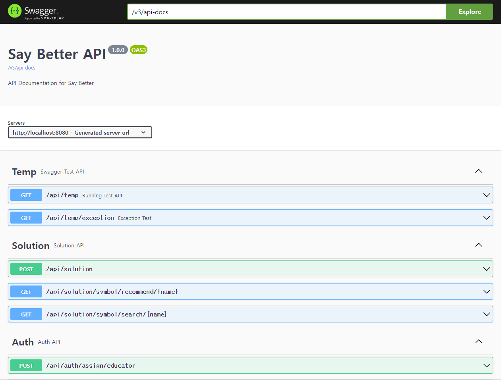

<center>
<h1> Say Better - Server Repo </h1>
</center>

<br>
<p align="center">

</p>

## Abstract

In this repository, Supports RESTful API for Say better service.

## File-Trees

> Overall structure for file tree of 'src' directory.

- if you want to see more detail, click the link.
    - [File Tree](docs/file-tree.md)

```bash
📦src
 ┗ 📂main
   ┣ 📂generated
   ┣ 📂java
   ┃ ┗ 📂com
   ┃   ┗ 📂saybetter
   ┃     ┣ 📂client
   ┃     ┃ ┣ 📂api
   ┃     ┃ ┃ ┗ 📂dto
   ┃     ┃ ┗ 📂converter
   ┃     ┣ 📂domain
   ┃     ┃ ┗ 📂temp
   ┃     ┃   ┣ 📂application
   ┃     ┃   ┣ 📂dao
   ┃     ┃   ┣ 📂domain
   ┃     ┃   ┣ 📂exception
   ┃     ┃   ┗ 📂ui
   ┃     ┣ 📂global
   ┃     ┃ ┣ 📂auth
   ┃     ┃ ┣ 📂common
   ┃     ┃ ┣ 📂config
   ┃     ┃ ┣ 📂jwt
   ┃     ┃ ┗ 📂utils
   ┃     ┗ 📜SayBetterApplication.java
   ┗ 📂resources
```

## System Architecture

> Overall structure for system architecture.

- if you want to see more upgrade version, click the link.
    - [System Architecture](docs/system-architecture.md)

<p align="center">

</p>

## Tech Stack

- [x] Spring Boot
    - Using Spring Boot for RESTful API
    - Using Spring Data JPA for Database Access
    - Using Spring Security for Security
    - Using Spring OpenFeign for Communication with Model Serving Server
- [x] CI/CD
    - Using Github Actions for CI/CD
    - `TODO`: change to Jenkins based CD (with github webhook)
- [x] LodBalancing
    - Using Nginx for LoadBalancing
- [x] Caching
    - Using Redis for Caching
    - Caching for
        - User Information (JWT)
        - User connect code
- [x] Security
    - Using `Spring Security` for Security and `OAuth2` for Google Social Login
    - Using `JWT` for Token based Authentication
- [x] Database
    - Using `MySQL` with `Cloud SQL` for RDBMS
    - `Applied`: Single Instance based RDBMS
    - `TODO`: change to Master-Slave based RDBMS
- [x] Storage
    - Using `Google Cloud Storage` for File Storage

## API Documentation

> API Documentation for Say Better Service with Swagger

<p align="center">

</p>

## Team Github page

- [SayBetter](https://saybetter.super.site/)
- [SayBetter-TeamDoc](https://github.com/Say-Better/Team-Docs)
- [SayBetter-Front](https://github.com/Say-Better/Android)
